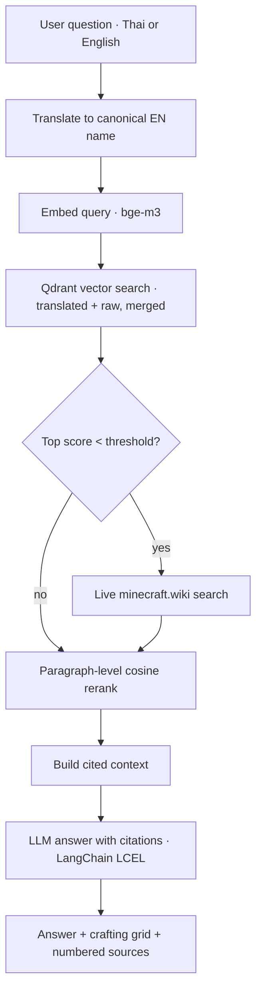

# Craft Oracle — a Minecraft wiki assistant

Ask **anything about Minecraft** — crafting, smelting, brewing/potions, trading,
mobs, items, and game mechanics — and get an answer **grounded in the Minecraft
Wiki with inline citations**, in Thai or English. Recipes resolve against an exact,
checkable corpus (X + Y → Z); broader questions fall back to **live, domain-restricted
search of `minecraft.wiki`**, so the assistant answers like the wiki itself rather
than only what was pre-curated.

It is **cross-lingual**: a Thai question is translated to the canonical English
item name before retrieval (so เครื่องปรุงยา finds *Brewing Stand*), and the raw
question is searched in parallel as a safety net.

Built to be small, honest, and production-shaped: embeddings, vector search,
paragraph-level reranking, a citation-enforced LLM step, and a real evaluation
harness. The retrieval engine is corpus-agnostic — point `ingest.py` at any folder
to re-aim it.

> Private by design: **no logging, no analytics, no user tracking.** The hosted
> demo sits behind a password so only people I share it with can use it.

**You need:** one **OpenRouter** API key (it powers both the LLM and the bge-m3
embeddings) and a **Qdrant** vector store — either a local file (zero setup, the
default) or **Qdrant Cloud** (free tier). Put both in `.env` (see `.env.example`).

---

## What it does

- **Broad coverage** — crafting, smelting, brewing, trading, mobs, mechanics —
  not just a fixed recipe list.
- **Multi-ingredient queries** — ask "what can I make with X and Y?" (e.g.
  stick + charcoal -> Torch, or 3 iron + 2 sticks -> pickaxe/axe). Answered via
  retrieval, so it handles common combinations — handy, not exhaustive.
- **Grounded answers with citations** — every claim points back to a numbered source.
- **Cross-lingual retrieval** — Thai questions are translated to the canonical
  English item name, and the raw query is searched alongside it.
- **Domain-restricted web fallback** — when the corpus is weak, it pulls live
  results from `minecraft.wiki` (on by default; toggle with `WEB_SEARCH`).
- **Deterministic crafting grid** — recipe answers render a clean 3x3 grid built
  from structured data, not from the LLM (which is unreliable at copying layouts).
- **Paragraph-level reranking** — retrieved docs are split into passages and
  re-scored against the query, so the model gets focused context, not noise.
- **Behind-the-scenes panel** — the UI exposes the retrieved passages and their
  cosine scores, so you can see *why* the model answered the way it did.
- **Evaluation harness** — keyword pass-rate, LLM-as-judge faithfulness, and
  latency (avg / p90). See [`eval/RESULTS.md`](eval/RESULTS.md).

## Architecture



**Stack:** Python · LangChain (LCEL) · Qdrant (local or Cloud) · bge-m3
embeddings · OpenRouter LLM · Streamlit. Embeddings and the LLM run through
OpenAI-compatible APIs, so nothing heavy is installed locally.

## Quickstart

```bash
pip install -r requirements.txt
python bootstrap.py              # scaffolds .env, then ingests the corpus (one command)
streamlit run app.py             # open the demo
python -m eval.run_eval          # run the evaluation harness
```

`bootstrap.py` creates `.env` on first run and asks you to paste **one OpenRouter
key** (used for both the LLM and bge-m3 embeddings). Run it again to ingest.

Manual steps, if you prefer:

```bash
cp .env.example .env             # paste your OpenRouter key into LLM_API_KEY + EMBED_API_KEY
python fetch_recipes.py          # (optional) rebuild recipe docs from minecraft-data -> data/recipes
python fetch_smelting.py         # (optional) rebuild smelting recipe docs -> data/smelting
python ingest.py --folder data/recipes --recreate   # embed crafting recipes (fresh collection)
python ingest.py --folder data/smelting             # add smelting recipes
```

**Local vs Qdrant Cloud:** by default the index is a local file. To use Qdrant
Cloud instead, just set `QDRANT_URL` + `QDRANT_API_KEY` in `.env` and re-run
`python ingest.py` — no code change. Re-aim at any topic with
`python ingest.py --folder my_docs`.

## Deploy (Hugging Face Spaces)

1. Create a **Streamlit** Space.
2. Upload these files (or connect the GitHub repo).
3. In **Settings → Variables and secrets**, add `LLM_API_KEY`, `EMBED_API_KEY`,
   and `APP_PASSWORD` (gate the demo). To use managed Qdrant, also add
   `QDRANT_URL` + `QDRANT_API_KEY`.
4. The Space runs `app.py`. Run `ingest.py` once (locally against Qdrant Cloud,
   or via a Space terminal) to populate the index.

## Configuration

All behaviour is controlled from `.env` (see `.env.example`): models, providers,
Qdrant location, retrieval `TOP_K` / `RERANK_TOP` / `SCORE_THRESHOLD`, chunking,
the access password, and the web-search toggle.

## Notes

- **Local vs Cloud vector store:** leave `QDRANT_URL` empty for a local file-based
  index; set it to run on Qdrant Cloud's free tier — same code either way.
- **Why API embeddings:** keeps `torch` and multi-GB models off the machine and
  makes local and hosted behaviour identical.

---

Built by **Salmon** · part of a portfolio demonstrating RAG, vector search,
reranking, and evaluation. The engineering reasoning lives in
[`DECISIONS.md`](DECISIONS.md).
